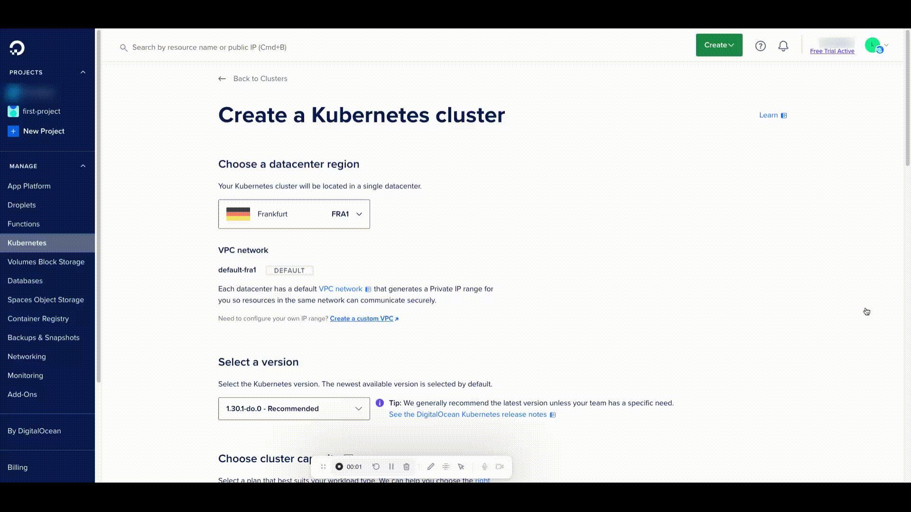
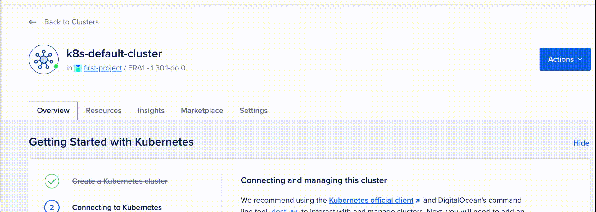
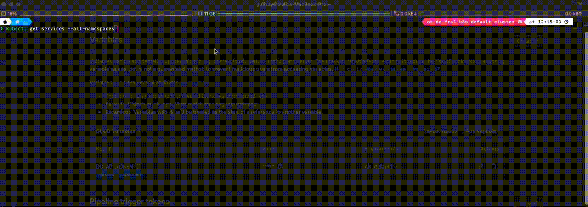
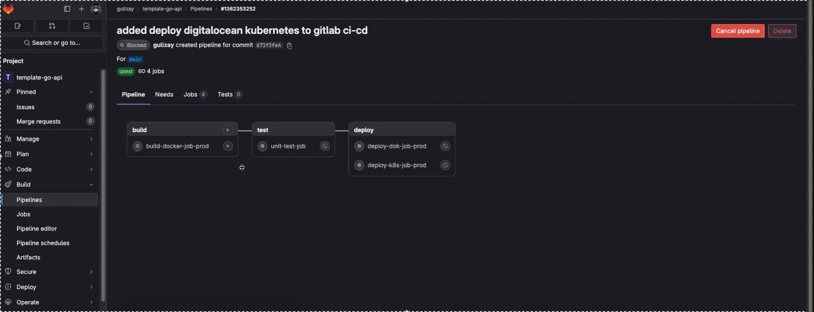
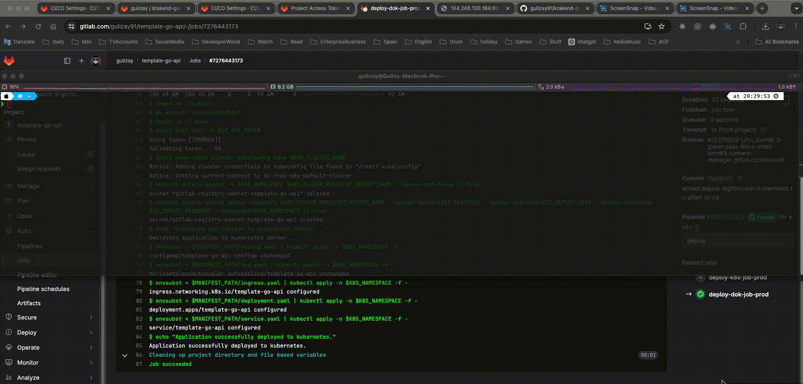

# template-go-api

## Folder Structure
ref: https://www.youtube.com/watch?v=dxPakeBsgl4
```
├── README.md
├── app
│   ├── cmd
│   │   ├── main.go                     // entry point
│   │   └── services
│   │       ├── services.go             // run all services
│   │       ├── config.service.go       // init config
│   │       └── framework.service.go    // init router
│   ├── config
│   │   └── config.go                   // all config models
│   ├── Dockerfile                      // dockerfile
│   ├── env.example.yaml                // environment variables
│   ├── go.mod
│   ├── go.sum
│   ├── docs
│   │   └── docs.go
│   │   └── swagger.yaml                // swagger files
│   ├── routers
│   │   └── router.go                   // all endpoints
│   ├── pkg
│   │   ├── handlers                    // all handlers
│   │   ├── models                      // all dtos
│   │   ├── repository                  // all repositories
│   │   │   └── entities                // all db entities
│       └── service                     // all services
├── .gitlab-ci.yml                      // devops ci/cd
├── k8s-manifests
│   ├── .env                            // define base environment variables
│   ├── deployment.yaml                 // kubernetes deployment
│   ├── config.yaml                     // kubernetes service configMap
│   ├── hpa.yaml                        // kubernetes service horizontal pod autoscaler
│   ├── ingress.yaml                    // kubernetes service ingress
│   └── service.yaml                    // kubernetes service on cluster
```

## Swagger
## Generate Swagger Doc
```sh
# /template-go-api>
swag init --parseDependency -g app/cmd/main.go -o app/docs
```

## Docker
### build docker image
```sh
# /template-go-api>
docker build --build-arg SERVICE_PORT=7001 -t template-go-api ./app
docker run -p 7001:7001 -e SERVICE__ENVIRONMENT=dev -e SERVICE__PORT=7001 --name template-go-api template-go-api
```
or you can use phony target
### makefile
```sh
# /template-go-api>
make run_docker_restapi
make stop_docker_restapi
make docker_latest_image
make update_swagger
```
## K8S - Deployment
```sh
# /krakend-gateway>
kubectl apply -k /k8s-manifests
```

### DigitalOcean Kubernetes Cluster


Follow the instructions for connection digital ocean kubernetes cluster



```sh
doctl kubernetes cluster kubeconfig save <your-token>
kubectl cluster-info
```


Also we need Kubernetes Metric Server for horizontal pod autoscaler (hpa.yaml)


Make sure Add DO_API_TOKEN variable to GitLab CI/CD Settings Variables, and CI_DEPLOY_USER and CI_DEPLOY_PASSWORD for the docker registry in access token


Run GitLab Pipeline, Deploy to DigitalOcean Kubernetes cluster


Check Kubernetes Deployment


### Kubernetes Network Topology
